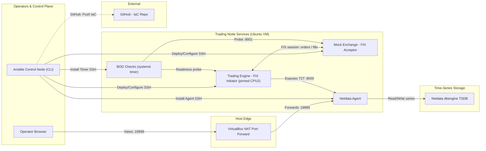

# trade-ops-ansible

A miniature, fully-automated **trade-operations environment** that mirrors the day-to-day responsibilities of a Trade Operations Engineer at a low-latency / HFT trading firm. It is built and managed entirely with Ansible, runs a simulated FIX order flow with live **tick-to-trade (T2T)** latency measurement, exposes everything on a real-time dashboard, and gates a simulated market open with **Beginning-of-Day (BOD)** readiness checks.

> **Honest framing up front:** this runs inside a VirtualBox VM on a laptop. The *workflows, automation, parameter knowledge, and instrumentation* are production-faithful. The *absolute latency numbers are not* — a VM on a shared host cannot produce production-grade determinism. Throughout, latency figures are treated as a **methodology demonstration** — relative before/after deltas, not absolute microsecond claims.

---

## What this demonstrates

This project deliberately exercises every line of the Trade Operations Engineer job description:

- **Low-latency infrastructure management** — kernel tuning for CPU isolation, hugepages, and network latency, applied idempotently with Ansible.
- **Automation with Ansible** — playbooks, roles, inventory, handlers, `--check` mode, and `ansible-lint` clean at the `production` profile.
- **Linux kernel parameter tuning** — `isolcpus` / `nohz_full` / `rcu_nocbs`, Transparent Huge Pages disabled, explicit hugepages, a set of low-latency network sysctls, IRQ-affinity pinning to housekeeping cores, and preemption-model detection.
- **Beginning-of-Day checks** — a readiness script run pre-open by a systemd timer, gating the market open.
- **Monitoring & alerting** — a live dashboard with per-core CPU, interrupts, context switches, network, and a **custom tick-to-trade histogram** from the trading engine.
- **End-to-end stack literacy** — a simulated FIX 4.2 session (logon, orders, execution reports) between a trading engine and a mock exchange.
- **Troubleshooting latency / high availability** — two live demos: `tc/netem` latency injection (watch T2T spike on the dashboard) and a failover/self-heal demo (kill a service, watch systemd recover it).

---

## Architecture

Four logical planes run on a single Ubuntu "trading node" VM:

| Plane | Components | Purpose |
|---|---|---|
| **Control plane** | Ansible (control node) | Deploys and configures everything over SSH; the single source of truth (Infrastructure-as-Code). |
| **Data plane** | Trading Engine (FIX initiator), Mock Exchange (FIX acceptor) | Simulated order flow; the engine is pinned to the isolated CPU core. |
| **Monitoring plane** | Netdata agent + dbengine TSDB | Collects system metrics and scrapes the engine's tick-to-trade metrics; serves the dashboard. |
| **Readiness plane** | BOD checks (systemd service + timer) | Verifies the node is market-ready before the open. |



---

## Repository structure

```
trade-ops-ansible/
├── ansible.cfg                  # Ansible defaults: inventory, roles path, become, YAML output
├── inventory/
│   └── hosts.yml                # The trading-node target (reached over SSH)
├── playbooks/
│   └── site.yml                 # Top-level play: runs all roles in order
├── roles/
│   ├── kernel-tuning/           # CPU isolation, hugepages, THP off, low-latency sysctls (+ GRUB)
│   ├── monitoring-agent/        # Netdata install + bind config + Prometheus scrape
│   ├── trading-app-deploy/      # venv + mock exchange + trading engine + systemd units
│   └── bod-checks/              # BOD readiness script + config + systemd service & timer
├── scripts/
│   └── latency_demo.sh          # tc/netem latency-injection demo helper
├── README.md
└── ProjectDeepDive.md          # Full design/ops study guide (read this to understand everything)
```

---

## Prerequisites

- A host with hardware virtualization, VirtualBox installed, and (on Windows) Hyper-V / WSL2 **disabled** so VirtualBox gets exclusive VT-x.
- An Ubuntu Server VM (this build used 4 vCPU / 3 GB RAM / 25 GB disk) with OpenSSH installed.
- VirtualBox NAT port-forwards: host `2222 → 22` (SSH), `19999 → 19999` (Netdata), optionally `8000 → 8000` (raw metrics).

## How to run

```bash
# From the repo root on the trading node
ansible-lint playbooks/ roles/                       # lint (clean at 'production' profile)
ansible-playbook playbooks/site.yml --check --diff   # dry run — preview every change
ansible-playbook playbooks/site.yml                  # apply for real
```

After the **first** apply (which changes the kernel command line), reboot once so CPU isolation takes effect, then re-run to converge:

```bash
sudo reboot
# reconnect, then:
ansible-playbook playbooks/site.yml
```

## Access points

| Service | Where | Port | Reached via |
|---|---|---|---|
| SSH | trading node | 22 | host `127.0.0.1:2222` (NAT forward) |
| Netdata dashboard | trading node | 19999 | browser `http://127.0.0.1:19999` |
| Engine metrics | trading node | 8000 | Netdata scrape (loopback); optional host `:8000` |
| Mock exchange (FIX) | trading node | 9001 | internal loopback only |

---

## Roles

| Role | What it does | Key outcomes |
|---|---|---|
| `kernel-tuning` | Sets `isolcpus=2 nohz_full=2 rcu_nocbs=2 transparent_hugepage=never` on the GRUB cmdline; applies low-latency sysctls; reserves hugepages; sets governor (bare-metal only); disables irqbalance (if present); pins device IRQs to a computed housekeeping mask (off the isolated core); detects and reports the kernel preemption model. | `/proc/cmdline` shows isolation; 64 hugepages reserved; THP off; device IRQs land on housekeeping cores (e.g. `0xa`). |
| `monitoring-agent` | Installs Netdata (static build), binds it on all interfaces, configures it to scrape the engine's Prometheus endpoint. | Dashboard on `:19999`, scraping `:8000`. |
| `trading-app-deploy` | Creates a Python venv, installs `simplefix` + `prometheus-client`, deploys the mock exchange and trading engine, installs their systemd units (engine pinned to CPU 2), tells Netdata to scrape the engine. | Two running services; live T2T metrics. |
| `bod-checks` | Deploys the BOD readiness script + config; installs a systemd service and a pre-open timer (Mon–Fri 08:45 IST); sets the timezone; ensures chrony. | `bod-check.timer` armed; `bod_check.sh` returns PASS/WARN/FAIL. |

---

## The trading application (simulated FIX)

- **Mock Exchange** (`mock_exchange.py`) — a FIX 4.2 **acceptor** listening on `:9001`. Acknowledges Logon and replies to every `NewOrderSingle (35=D)` with a filled `ExecutionReport (35=8)`.
- **Trading Engine** (`trading_engine.py`) — a FIX 4.2 **initiator**. Logs on, then continuously sends orders from a list of ~300 hardcoded signals, measures the round-trip **tick-to-trade** latency (signal → execution report), and exposes it as Prometheus metrics.

> **Note on ITCH/OUCH:** those are Nasdaq protocols, not NSE/BSE, so this project uses a vendor-neutral generic **FIX** session to demonstrate stack literacy. India's venues use NSE's NNF interface and TBT/MTBT market-data feeds — covered in the deep-dive.

## Metrics exposed by the engine (`:8000/metrics`)

| Metric | Type | Meaning |
|---|---|---|
| `engine_tick_to_trade_seconds` | Histogram | T2T latency distribution (buckets → p50/p95/p99). |
| `engine_t2t_microseconds` | Gauge | Most recent T2T sample, in µs (a clean dashboard line). |
| `engine_orders_total` | Counter | Orders sent (rate = orders/sec). |
| `engine_fills_total` | Counter | Execution reports received. |

The dashboard shows these alongside system metrics: **per-core CPU** (including the isolated cpu2), **context switches**, **interrupts**, **network throughput/errors**, **memory**, and **disk**.

---

## The two live demos

- **Latency injection** — `sudo ./scripts/latency_demo.sh on` injects `5ms ± 1ms` of `netem` delay on the loopback interface; T2T jumps from ~1.2 ms to ~11 ms live on the dashboard; `off` restores it. Demonstrates latency troubleshooting / bottleneck identification.
- **Failover / self-heal** — `sudo systemctl kill -s SIGKILL trading-engine` → `Restart=on-failure` brings it back in ~2 s (HA). A clean `systemctl stop` instead leaves it down, so a BOD run returns **NOT READY (exit 2)**, demonstrating the readiness gate.

---

## Mapping to the Trade Operations Engineer role

| JD responsibility | Where it lives in this project |
|---|---|
| Manage/optimize low-latency infrastructure | `kernel-tuning` role + isolated-core engine |
| Automation with Ansible | Entire repo: roles, inventory, handlers, `--check`, lint |
| Python & Bash ops scripts | `trading_engine.py`, `mock_exchange.py`, `bod_check.sh`, `latency_demo.sh` |
| Linux kernel parameter tuning | `kernel-tuning` role (CPU/memory/network) |
| Daily system / BOD checks before open | `bod-checks` role + `bod-check.timer` |
| Monitor trading systems / raise alerts | Netdata + tick-to-trade metrics + BOD exit codes |
| Troubleshoot network/system latency | `tc/netem` demo + per-core/IRQ dashboards |
| High availability / minimal downtime | `Restart=on-failure` systemd self-heal demo |

---

## Honest limitations

- **VM, not bare metal.** Latency numbers reflect host-scheduler jitter, not silicon determinism. Real validation requires bare metal with pinned cores, BIOS C-states/turbo disabled, a PREEMPT_RT or tickless kernel, and a 24-hour `cyclictest` under load.
- **CPU governor** isn't exposed inside the VM, so that tuning is skipped (and clearly noted) — it's a BIOS/bare-metal step.
- **IRQ pinning is best-effort and honestly reported.** `smp_affinity` is a *request* the kernel intersects with what each IRQ allows; the role reports the *effective* mask it reads back, not the requested one (on this VM `0xb` settled to `0xa`). **PREEMPT_RT** is detected and reported, not installed — that's a separate kernel build, out of scope. Together with the governor and irqbalance skips, these are four honest "I know the bare-metal step; here's what the VM allows" demonstrations.
- **Control and managed node are co-located** on one VM for resource reasons. The Ansible roles, inventory, SSH transport, and idempotency are identical to managing remote colocation servers; in production you simply point the inventory at the colo hosts.

## Tech stack

Ubuntu Server · Ansible / ansible-lint · Netdata · Python 3 (`simplefix`, `prometheus-client`) · systemd · chrony · `tc/netem` · `rt-tests` (`cyclictest`) · VirtualBox · Git/GitHub.

**For the full reasoning behind every decision, a line-by-line explanation of the FIX scripts, a complete data-flow map, and an FAQ, see [`ProjectDeepDive.md`](./ProjectDeepDive.md).**